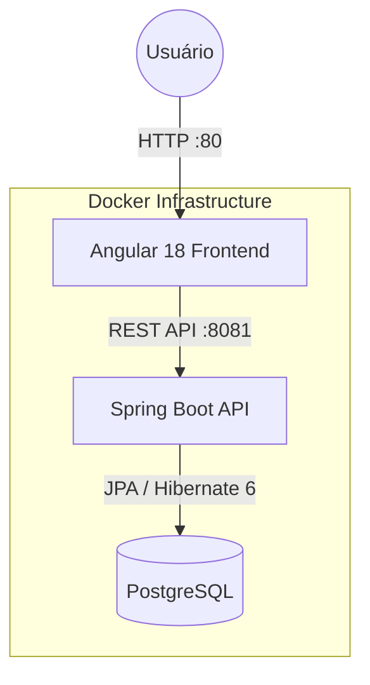

# Fullstack Todo List  
### Spring Boot 3.4 • Angular 18 • PostgreSQL • Docker

Este projeto demonstra uma **arquitetura fullstack moderna, escalável e resiliente**, combinando um backend robusto em **Java 17 com Spring Boot 3.4** e um frontend reativo construído em **Angular 18**.  

A solução é **100% conteinerizada**, utiliza **PostgreSQL** como banco relacional e foi projetada seguindo boas práticas de engenharia de software, separação de responsabilidades e inicialização resiliente.

---

## 📌 Visão Geral

- Backend RESTful seguindo padrões modernos do ecossistema Spring
- Frontend reativo com gerenciamento de estado eficiente
- Infraestrutura conteinerizada com Docker Compose
- Persistência relacional com controle de exclusão lógica (Soft Delete)
- Comunicação segura entre serviços via CORS configurado em nível de filtro

---

## 🛠️ Tech Stack

### Backend
- **Java 17**
- **Spring Boot 3.4**
- **Spring Data JPA (Hibernate 6)**
- **Lombok** – Redução de boilerplate e ganho de produtividade
- **Jakarta Validation** – Validações e regras de negócio no nível de DTO
- **PostgreSQL 15** – Persistência de dados relacional

### Frontend
- **Angular 18**
- **Standalone Components**
- **Signals** – Gerenciamento de estado reativo e granular
- **RxJS** – Programação reativa para fluxos assíncronos
- **SCSS** – Estilização modular e escalável

### Infraestrutura & DevOps
- **Docker Compose**
- **Nginx** – Servidor de arquivos estáticos para o frontend
- **Healthchecks** – Garantia de ordem correta de inicialização dos serviços
- **Docker Compose** – Orquestração dos serviços

---

## 🌟 Diferenciais Técnicos

### 1. Soft Delete Global
Implementado com **Hibernate 6** utilizando as anotações:

- `@SQLDelete`
- `@SQLRestriction`

Essa abordagem garante que os registros **não sejam removidos fisicamente do banco**, atendendo requisitos de **compliance, auditoria e rastreabilidade**, mantendo total transparência para a camada de negócio.

---

### 2. Configuração de CORS com Highest Precedence
O CORS é configurado via `FilterRegistrationBean`, garantindo que requisições **Preflight (OPTIONS)** sejam tratadas **antes** de alcançar o contexto do Spring MVC.

Isso assegura:
- Comunicação correta entre containers
- Compatibilidade com navegadores modernos
- Maior controle e previsibilidade no tráfego HTTP

---

### 3. Inicialização Resiliente
O `docker-compose.yml` utiliza **healthcheck no PostgreSQL**, garantindo que:

- O banco esteja totalmente pronto antes da API iniciar
- Erros de conexão no boot inicial sejam evitados
- A stack suba de forma previsível e confiável

---

## 🚀 Como Executar o Projeto

### Pré-requisitos
- **Docker**
- **Docker Compose**

---

### Passo a Passo

#### 1. Clone o repositório
```bash
git clone https://github.com/SEU_USUARIO/fullstack-todo-app.git
cd fullstack-todo-app
```

#### 2. Suba a stack completa
```bash
docker compose up --build
```

#### 3. Acesse a aplicação

- Frontend: [http://localhost](http://localhost)
- Backend: [http://localhost:8081/api/todos](http://localhost:8081/api/todos)


### 🔗 Endpoints da API

| Método | Endpoint          | Descrição                          |
| -----: | ----------------- | ---------------------------------- |
|    GET | `/api/todos`      | Lista todas as tarefas ativas      |
|   POST | `/api/todos`      | Cria uma nova tarefa               |
|    PUT | `/api/todos/{id}` | Atualiza dados ou status da tarefa |
| DELETE | `/api/todos/{id}` | Exclusão lógica (Soft Delete)      |

### 🏗️ Arquitetura do Sistema

A aplicação foi desenhada seguindo princípios de alta disponibilidade, baixo acoplamento e separação de responsabilidades (SoC).

## 🗺 Roadmap de Evolução
- [x] Implementação de Mensageria Assíncrona com **RabbitMQ**.
- [ ] Implementação de **GraphQL** para consultas customizadas.
- [ ] Adição de documentação interativa com **Swagger / OpenAPI 3**.



---

### 📄 Licença

Este projeto é disponibilizado para fins educacionais e demonstrativos.
Sinta-se à vontade para estudar, adaptar e evoluir a solução conforme suas necessidades.